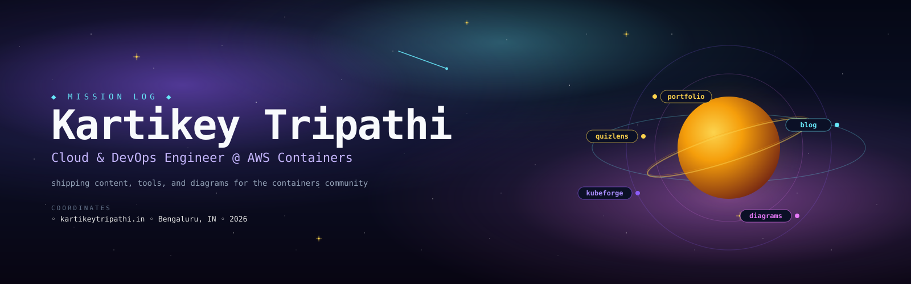

<div align="center">



<br/>

### ✦ *Cloud & DevOps Engineer @ AWS · shipping content, tools, and diagrams for the containers community* ✦

[](https://www.kartikeytripathi.in)
[](https://blogs.kartikeytripathi.in)
[](https://diagrams.kartikeytripathi.in)
[](https://www.linkedin.com/in/kartikeytripathi)

<br/>


</div>

---

## 🪐  Mission

This isn't just a résumé site — it's **mission control** for a small orbit of things I've been building on the side. An AWS Containers Support Engineer transitioning deeper into DevOps, publishing what I learn along the way.

Every satellite below is a self-contained deployment. This repo is the one you're looking at now — the hub.

---

## 🛰  The constellation

Five properties in orbit around a shared brand and shared writing voice.

| ✦ | Satellite | Purpose | Orbit |
|---|---|---|---|
| ◆ | **Portfolio** *(this repo)* | Hub · bio · work · projects · certs · contribution graph | [`kartikeytripathi.in`](https://www.kartikeytripathi.in) |
| ◇ | **Blog** | Long-form — EKS internals, ADOT, Karpenter, Lambda MicroVMs | [`blogs.kartikeytripathi.in`](https://blogs.kartikeytripathi.in) |
| ◈ | **AWS Diagrams** | Interactive architecture diagrams — searchable, filterable | [`diagrams.kartikeytripathi.in`](https://diagrams.kartikeytripathi.in) |
| ⎈ | **KubeForge** | 38-lab hands-on K8s + EKS platform for CKA / DevOps prep | [`kubeforge.kartikeytripathi.in`](https://kubeforge.kartikeytripathi.in) |
| 🔍 | **QuizLens** | Chrome extension: highlight a practice question → get the full breakdown | [`github.com/kartikeytripathi/quizlens`](https://github.com/kartikeytripathi/quizlens) |

---

## 🌌  Star map

The page reads top-to-bottom like a flight plan — every section is animated with Framer Motion, dark by default, monospace where it matters.

```
      ✦
       \
    ┌───────────────────────────────────────────────────────────┐
    │  ◆  HERO           avatar · bio · socials · location      │
    │  ◆  WORK           timeline · role progression            │
    │  ◆  SKILLS         Cloud · DB · DevOps · Web · Languages  │
    │  ◆  PROJECTS       KubeForge · QuizLens · SVG heroes      │
    │  ◆  CERTS          AWS SAA · AIF · CCP · OCI · BeSA       │
    │  ◆  BLOG           latest 3 posts + featured video        │
    │  ◆  CONTRIBUTIONS  live GitHub graph · views · love       │
    │  ◆  CTA            email · Topmate 1:1 · calendar hook    │
    └───────────────────────────────────────────────────────────┘
                                                              \
                                                               ✧
```

**Also aboard:**
- 🌠  Cursor spotlight · scroll progress bar · back-to-top thruster
- ♿  Semantic HTML · focus states · `prefers-reduced-motion` respected
- 🚀  JSON-LD structured data · OG image · sitemap · robots.txt
- 🔒  XSS-hardened JSON-LD sinks · server-only DB access · no client secrets
- 📱  Mobile-first responsive layout down to 320px

---

## ⚙  Ship systems

| Layer | Choice | Why |
|---|---|---|
| **Framework** | Next.js 15 (App Router) | Server components, streaming, image optimizer, edge-friendly |
| **Language** | TypeScript 5 | Type safety across data config + components |
| **Styling** | Tailwind CSS 4 | Utility-first, no runtime, dark-mode-first design |
| **Animation** | Framer Motion | Enter-viewport reveals, subtle hover choreography |
| **Data** | MongoDB Atlas | Love-counter, view tracking — read/write through server actions |
| **Icons** | react-icons (Fa/Si) | Vendor-accurate brand marks for the skills grid |
| **Hosting** | Vercel | Preview deploys per PR, prod on `main` |

---

## 🚀  Launch locally

```bash
git clone https://github.com/kartikeytripathi/kartikeytripathi.github.io.git
cd kartikeytripathi.github.io

npm install

cp .env.example .env.local        # fill MONGODB_URI

npm run dev                       # → http://localhost:3000
```

### Flight commands

| Command | What it does |
|---|---|
| `npm run dev` | Turbopack dev server |
| `npm run build` | Production build |
| `npm run start` | Serve the production build locally |
| `npm run lint` | ESLint over `src/` |

---

## 🔐  Life support (env vars)

| Variable | Required | Purpose |
|---|---|---|
| `MONGODB_URI` | ✅ | MongoDB Atlas connection string — used by server actions for the love/views counter |

Never commit `.env.local`. `.env.example` in the repo is the canonical placeholder.

---

## 🗺  Ship's blueprint

```
src/
├── app/                   # App Router: pages, layout, server actions
├── components/            # Section components (Hero, Projects, Certifications, …)
│   └── ui/                # shadcn-flavoured primitives
├── config/                # data.ts — content lives here as typed exports
├── content/               # MDX / structured blog content shims
├── lib/                   # Server-only helpers (DB, MDX, utils)
├── model/                 # Mongoose schemas
└── middleware.ts          # request-time headers, CSP hooks

public/
├── images/                # project heroes (webp + SVG), blog assets, about
└── icons/                 # OG image, favicons, resume.pdf
```

Content is data-driven — most of what you see on the site is edited by touching `src/config/data.ts`, no component code changes required.

---

## 📜  Signal

© 2026 Kartikey Tripathi · [MIT-flavoured license](./LICENSE) for code; **content and images are all rights reserved**.

<div align="center">

<br/>

**✦   Built and maintained solo. If any of it saved you a Google, ⭐ the repo or send a signal.   ✦**

[](mailto:kartikey.tripathi.37@gmail.com)
[](https://github.com/kartikeytripathi)

<br/>

<sub>*mission log · v2026 · orbit stable*</sub>

</div>
