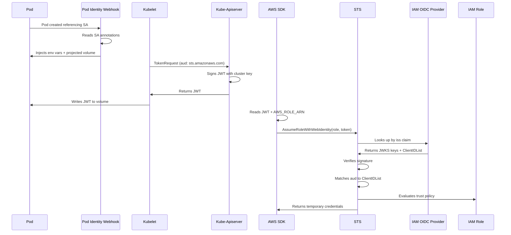

If you've spent any time running workloads on Amazon EKS, you've used IRSA — IAM Roles for Service Accounts. It's the standard way a pod gets AWS credentials. Most of the time, it just works. But when it doesn't, the failure modes can be deeply non-obvious. The error message might be a few words long, and yet the root cause can live in any of half a dozen components.

This post walks through one particularly sneaky failure: `InvalidIdentityToken: Incorrect token audience`. It's the kind of error where every IRSA primitive looks correct under inspection, every checklist passes, and the fix turns out to be a single invisible character. To understand why it happens, we need to walk through what IRSA actually does under the hood — which is worth doing anyway, because the same mental model unlocks every other IRSA failure mode too.

## The problem IRSA solves

There are two identity systems that know nothing about each other:

- **Kubernetes** has Service Accounts. A pod runs as a Service Account; this is just a username inside the cluster with no inherent meaning to AWS.
- **AWS** has IAM Roles. A role is an identity with attached permissions; it has no notion of Kubernetes Service Accounts.

A pod (running as an SA) needs to call an AWS API (using an IAM Role). The two sides need a way to trust each other. IRSA is that bridge.

The bridge works by using a third-party standard — OpenID Connect — to let AWS verify identity claims made by the Kubernetes API server, without either side having to know the other directly.

## The pieces, one at a time

Before showing the full flow, here are the building blocks.

### Service Account

A namespaced Kubernetes resource (`serviceaccounts.v1.core`). To opt a Service Account into IRSA, you add an annotation:

```yaml
apiVersion: v1
kind: ServiceAccount
metadata:
  name: ebs-csi-controller-sa
  namespace: kube-system
  annotations:
    eks.amazonaws.com/role-arn: arn:aws:iam::123456789012:role/AmazonEKS_EBS_CSI_DriverRole
```

The annotation is the trigger for everything else.

### IAM Role

An AWS identity with two policies attached:

- A **trust policy** that says *who* can assume it — in IRSA's case, a federated OIDC principal.
- **Permissions policies** that say *what* it can do once assumed.

A typical IRSA trust policy for a single SA:

```json
{
  "Version": "2012-10-17",
  "Statement": [{
    "Effect": "Allow",
    "Principal": {
      "Federated": "arn:aws:iam::123456789012:oidc-provider/oidc.eks.us-east-1.amazonaws.com/id/EXAMPLED..."
    },
    "Action": "sts:AssumeRoleWithWebIdentity",
    "Condition": {
      "StringEquals": {
        "oidc.eks.us-east-1.amazonaws.com/id/EXAMPLED...:sub": "system:serviceaccount:kube-system:ebs-csi-controller-sa",
        "oidc.eks.us-east-1.amazonaws.com/id/EXAMPLED...:aud": "sts.amazonaws.com"
      }
    }
  }]
}
```

The `:sub` condition pins the role to a specific SA in a specific namespace. The `:aud` condition is a security boundary — without it, any token signed by the cluster's OIDC issuer could potentially assume the role if it can guess the `:sub`.

### JWT — the bridge token

A JSON Web Token has three parts joined by dots: `header.payload.signature`. The payload an EKS cluster mints for IRSA looks like:

```json
{
  "iss": "https://oidc.eks.us-east-1.amazonaws.com/id/EXAMPLED...",
  "sub": "system:serviceaccount:kube-system:ebs-csi-controller-sa",
  "aud": ["sts.amazonaws.com"],
  "exp": 1716800000,
  "iat": 1716796400,
  "kubernetes.io": {
    "namespace": "kube-system",
    "pod": { "name": "ebs-csi-controller-xyz", "uid": "..." },
    "serviceaccount": { "name": "ebs-csi-controller-sa", "uid": "..." }
  }
}
```

Three claims drive IRSA:

- `iss` — who issued it (the cluster's OIDC URL)
- `sub` — who the token represents (the Service Account)
- `aud` — who the token is meant for (`sts.amazonaws.com`)

The signature is RSA-SHA256 over the header and payload, signed with the cluster's private signing key.

### OIDC and the IAM OIDC Identity Provider

Every EKS cluster automatically acts as an OIDC issuer. It publishes two public endpoints:

| Endpoint | Path | Contents |
|---|---|---|
| Discovery | `<issuer>/.well-known/openid-configuration` | JSON metadata including `jwks_uri` |
| JWKS | `<issuer>/keys` | The public keys used to verify tokens |

Both are served from S3 via CloudFront. Anyone can fetch them and verify a JWT the cluster signed.

On the AWS side, you create an **IAM OIDC Identity Provider** — a registration that says *"trust JWTs signed by this OIDC issuer."* It has three important fields:

| Field | Purpose |
|---|---|
| `Url` | The OIDC issuer URL |
| `ClientIDList` | The list of acceptable `aud` claim values — exact byte-match |
| `ThumbprintList` | SHA-1 thumbprints of the issuer's TLS cert chain |

That `ClientIDList` field is where today's bug lives.

### Projected Service Account Token

The Kubernetes mechanism that puts a fresh JWT in the pod's filesystem. The PodSpec includes a `projected` volume:

```yaml
volumes:
- name: aws-iam-token
  projected:
    sources:
    - serviceAccountToken:
        audience: sts.amazonaws.com
        expirationSeconds: 86400
        path: token
volumeMounts:
- name: aws-iam-token
  mountPath: /var/run/secrets/eks.amazonaws.com/serviceaccount
  readOnly: true
```

At runtime, kubelet calls the kube-apiserver's `TokenRequest` API to mint the JWT, writes it to the mounted file, and rotates it before expiry (at roughly 80% of TTL).

### EKS Pod Identity Webhook

A MutatingAdmissionWebhook running on the EKS control plane, open-sourced as [`amazon-eks-pod-identity-webhook`](https://github.com/aws/amazon-eks-pod-identity-webhook). It intercepts pod creation, reads the pod's Service Account annotations, and — if the role-arn annotation is present — patches the PodSpec to add:

- Environment variables (`AWS_ROLE_ARN`, `AWS_WEB_IDENTITY_TOKEN_FILE`, `AWS_REGION`, `AWS_STS_REGIONAL_ENDPOINTS`)
- The projected token volume
- The volume mount

On EKS, AWS runs this for you. Without the webhook, IRSA simply doesn't happen — the pod gets no token and no env vars.

### STS AssumeRoleWithWebIdentity

The AWS API that swaps a JWT for temporary credentials. It's the only STS API that doesn't require pre-existing credentials, because it's specifically designed for federated identity exchange.

## The full flow

Putting it all together:



The validation at STS is where things can go wrong. STS does three checks:

| Check | What it verifies | What can go wrong |
|---|---|---|
| Signature | The JWT was signed by the cluster's private key | Wrong issuer registered as OIDC provider; expired/rotated keys (rare on managed EKS) |
| Audience | The token's `aud` claim is in the OIDC provider's `ClientIDList` | Whitespace, typo, missing audience |
| Trust policy | The role's trust policy `Condition` allows this SA | Wrong sub/aud values, wrong condition operator |

## The one-character bug

`InvalidIdentityToken: Incorrect token audience` means the second check failed. STS performs an exact byte-for-byte string match between the JWT's `aud` claim and each entry in the `ClientIDList`. Any difference — including invisible whitespace — fails the match.

The trap is that the IAM console renders trailing whitespace invisibly. You can stare at the OIDC provider configuration in the console and see nothing wrong. The actual contents are only visible through the API:

```bash
aws iam get-open-id-connect-provider \
  --open-id-connect-provider-arn arn:aws:iam::123:oidc-provider/oidc.eks.us-east-1.amazonaws.com/id/EXAMPLED...
```

If the response looks like this:

```json
{
  "Url": "oidc.eks.us-east-1.amazonaws.com/id/EXAMPLED...",
  "ClientIDList": ["sts.amazonaws.com "],
  "ThumbprintList": ["..."]
}
```

— look closely at the trailing space inside the quotes — that's the bug. The token's `aud` is `sts.amazonaws.com` (no space), and the ClientIDList has `sts.amazonaws.com ` (with space). Exact match fails. STS returns `InvalidIdentityToken: incorrect token audience`.

How does this happen in the first place? A few ways:

- Hand-edited Terraform with a stray space in the `client_id_list` argument
- CloudFormation with whitespace in a `ClientIDList` parameter value
- Copy-paste from documentation with an invisible trailing character
- Older IaC provider versions that didn't normalize whitespace

Fix it in place without recreating the provider:

```bash
aws iam remove-client-id-from-open-id-connect-provider \
  --open-id-connect-provider-arn <arn> \
  --client-id "sts.amazonaws.com "

aws iam add-client-id-to-open-id-connect-provider \
  --open-id-connect-provider-arn <arn> \
  --client-id "sts.amazonaws.com"
```

After this, recreate the add-on or restart the pods that were failing — they'll pick up fresh credentials on the next `AssumeRoleWithWebIdentity` call.

## A structured approach to debugging IRSA

The audience bug isn't the only thing that can cause IRSA failures. Here's a step-by-step approach that works for the whole class.

### Step 1: Determine where the failure happens

The first question is whether the pod even tries to call STS. Two failure classes look superficially similar:

- The pod has no AWS credentials at all (webhook didn't inject)
- The pod tries to call STS but the call fails

Check the pod's environment and volumes:

```bash
kubectl get pod <p> -o jsonpath='{.spec.containers[*].env}' | jq | grep AWS_
kubectl get pod <p> -o jsonpath='{.spec.volumes}' | jq
kubectl exec <p> -- ls /var/run/secrets/eks.amazonaws.com/serviceaccount/
```

If `AWS_ROLE_ARN` and `AWS_WEB_IDENTITY_TOKEN_FILE` are missing, the webhook didn't inject — likely because the pod was created before the SA annotation, or because the pod uses a different SA than you think.

### Step 2: Inspect the token

If the webhook injected, decode the token:

```bash
kubectl exec <p> -- sh -c 'cat /var/run/secrets/eks.amazonaws.com/serviceaccount/token' \
  | awk -F. '{print $2}' | base64 -d 2>/dev/null | jq
```

Look at the `iss`, `sub`, and `aud` claims. These need to match — exactly — what the IAM OIDC Provider and the role's trust policy expect.

### Step 3: Verify network reachability

If the token looks right, check that STS is actually reachable from the pod:

```bash
kubectl exec <p> -- curl -sv https://sts.<region>.amazonaws.com/ 2>&1 | head -20
```

For private EKS clusters without NAT, you'll need a VPC interface endpoint for STS (`com.amazonaws.<region>.sts`). Without it, the connection times out and the SDK retries without ever reaching STS.

### Step 4: Check the OIDC provider

This is where the audience bug lives:

```bash
aws iam get-open-id-connect-provider --open-id-connect-provider-arn <arn>
```

Verify:

- `Url` matches the cluster's OIDC issuer exactly. Run `aws eks describe-cluster --name <c> --query 'cluster.identity.oidc.issuer'` and compare, stripping the `https://` prefix.
- `ClientIDList` contains exactly `sts.amazonaws.com` — no extra whitespace, no extra entries.

### Step 5: Check the trust policy

```bash
aws iam get-role --role-name <r> --query 'Role.AssumeRolePolicyDocument'
```

Verify:

- The `Federated` principal ARN points to the right OIDC provider.
- The `Condition` block has both `:sub` and `:aud` checks.
- The `:sub` value matches `system:serviceaccount:<ns>:<sa>` exactly.
- The condition operator is right for your case (`StringEquals` for a single SA, `StringLike` if you want a namespace wildcard).

### Step 6: Check CloudTrail

CloudTrail records every `AssumeRoleWithWebIdentity` call with its error code:

```
EventName: AssumeRoleWithWebIdentity
ErrorCode: <varies>
ErrorMessage: <varies>
RequestParameters.roleArn: ...
RequestParameters.roleSessionName: ...
```

This is the most authoritative source. If you see no events at all, the SDK never made the call — go back to Step 1. If you see events with error codes, the error code tells you which check failed.

## Error-to-cause reference

For quick lookup when you're staring at an unfamiliar error:

| Error | Likely cause |
|---|---|
| `InvalidIdentityToken: incorrect token audience` | ClientIDList mismatch (whitespace, typo, wrong audience value) |
| `InvalidIdentityToken: couldn't retrieve verification key` | Issuer not registered as IAM OIDC Provider, or OIDC URL mismatch |
| `InvalidIdentityToken: JWT signature is invalid` | Signing key mismatch (rare on managed EKS) |
| `InvalidIdentityToken: Unable to parse JWT` | Truncated or malformed token file |
| `ExpiredTokenException` | Token past `exp`; clock skew; SDK cached creds too long |
| `AccessDenied` (with condition match failure) | Trust policy condition didn't match — sub or aud value is off |
| `AccessDenied: Not authorized to perform sts:AssumeRoleWithWebIdentity` | Trust policy missing the action entirely |
| SDK timeout / no creds | Pod can't reach STS (networking), or webhook didn't inject |

## The broader lesson

The audience bug is interesting because it exposes a common assumption: that if every component is correct in isolation, the system works. IRSA has six or seven components, and you can verify each one individually and still have it fail — because the failure lives in the byte-for-byte string comparison between a value in one component and a value in another.

The fix in cases like this isn't checking that "the configuration is correct" — it's checking that "the values in each component *agree*, byte for byte." For IRSA specifically, that means:

- The cluster's OIDC issuer URL exactly matches the IAM OIDC Provider's `Url`.
- The token's `aud` claim exactly matches a `ClientIDList` entry.
- The token's `sub` claim exactly matches the trust policy's `:sub` condition value.
- The role's trust policy's `Federated` principal exactly matches the OIDC Provider's ARN.

Any inequality at any of these links breaks the chain. This is true generally for any system that bridges two trust domains through a token — OIDC for IRSA, SAML for ADFS, OAuth for third-party APIs. The string comparisons at the boundary are the most fragile parts of the system, and they're the parts that are hardest to verify visually.

## Forward-looking: EKS Pod Identity

In late 2023, AWS released [EKS Pod Identity](https://docs.aws.amazon.com/eks/latest/userguide/pod-identities.html) as an alternative to IRSA. It uses a node-local agent (`eks-pod-identity-agent`) and Pod Identity Associations instead of OIDC. There's no IAM OIDC Identity Provider, no `ClientIDList`, no audience check, no JWKS verification — the trust path is direct between EKS and IAM.

For new workloads, Pod Identity is worth evaluating. Its trust model is simpler, it avoids this entire class of failure, and it scales better in accounts with many clusters (no orphan OIDC providers piling up). IRSA is still the more flexible choice for cross-account access, non-EKS workloads, or anywhere you need fine-grained audience control. But for in-account, EKS-only workloads on a recent cluster version, Pod Identity reduces the surface area for exactly the kind of bug this post is about.

## Wrapping up

IRSA's complexity comes from the number of moving parts: a Service Account, a webhook, a kubelet, a projected token, an OIDC issuer, an IAM OIDC Provider, an IAM Role with a trust policy, and an STS call. When it works, you don't think about any of them. When it fails, the error message points at one — but the bug can be in any of them.

The audience check is one of the trickier failure points because the bug is often invisible (literally — whitespace in a console field). The fix is fast once you know where to look, but knowing where to look requires understanding the whole flow.

The mental model worth keeping in your head: **SA → annotation → webhook → projected token → SDK → STS → OIDC Provider → role**. Walk that chain whenever you debug an IRSA issue, and you'll find the break.

---

*If you found this useful, you can find me on [LinkedIn](https://linkedin.com/in/kartikeytripathi/) or [GitHub](https://github.com/kartikeytripathi).*
